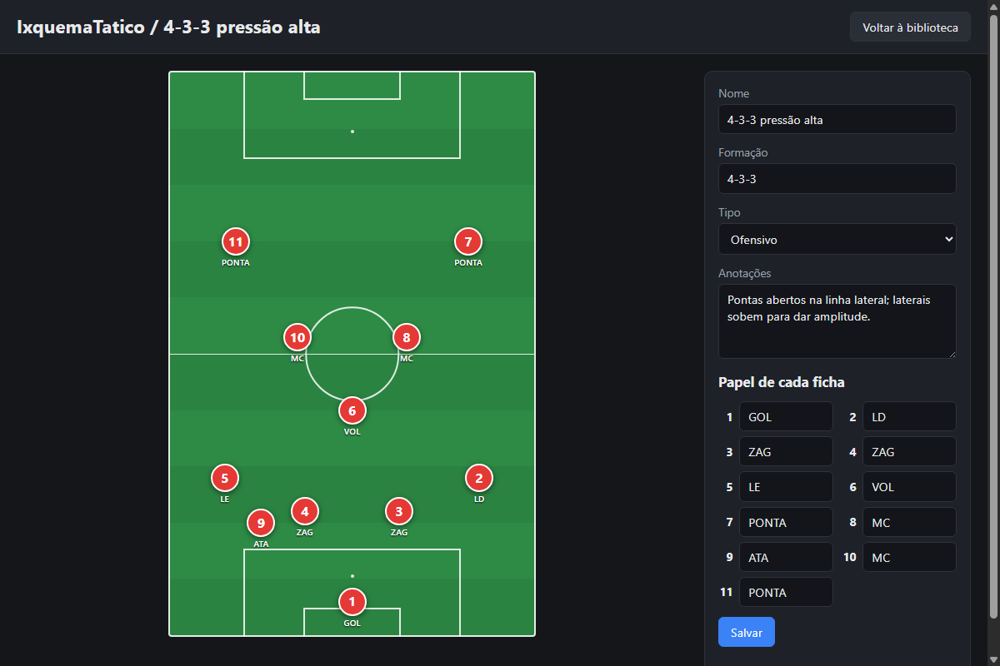

# ExquemaTatico API

Backend do ExquemaTatico, um quadro tático de futebol digital. O usuário monta esquemas
(formação, jogada, bola parada), posiciona 11 jogadores num campo e salva numa biblioteca
pessoal. Esta API guarda esses esquemas em SQLite e os expõe por REST com documentação
Swagger.

O frontend fica em outro repositório: `exquematatico-front`.



## Arquitetura

- `app.py`: cria a aplicação Flask (via flask-openapi3), declara os modelos Pydantic usados
  no Swagger, os handlers de erro e as rotas. As rotas são finas: recebem, chamam o serviço,
  respondem.
- `services.py`: regras de negócio. Valida o payload na ordem definida (payload, tipo, 11
  posições, números 1-11, números únicos, coordenadas 0-100, textos obrigatórios) e executa
  as operações no banco em transação.
- `database.py`: conexão SQLite (com `PRAGMA foreign_keys = ON`, necessário para o CASCADE
  funcionar), schema e `init_db()`, executado automaticamente ao subir a API.
- `seed.py`: opcional, cria dois esquemas de exemplo (um 4-3-3 ofensivo e um escanteio).

O banco é o arquivo `exquematatico.db`, criado ao lado de `app.py` na primeira execução.

### Modelo

Um esquema tem `nome`, `formacao` (texto livre), `tipo` (`ofensivo`, `defensivo` ou
`bola_parada`), `anotacoes` e exatamente 11 posições. Cada posição tem `numero` (1-11, único
no esquema), `papel` (texto curto, ex.: GOL, ZAG, PONTA) e `x`/`y`, que são a posição
percentual (0 a 100) do centro da ficha em relação ao campo. `(0, 0)` é o canto superior
esquerdo e `(100, 100)` o inferior direito. Por serem percentuais, o quadro é independente do
tamanho da tela.

`criado_em` é gerado pelo servidor em ISO 8601 UTC. O cliente nunca o envia; o PUT preserva o
original e a duplicação gera um novo.

## Instalação e execução

Requer Python 3.10 ou superior. Sem Docker, sem banco externo: o SQLite é um arquivo criado
automaticamente na primeira execução.

Windows (PowerShell):

```powershell
python -m venv .venv
.venv\Scripts\activate
pip install -r requirements.txt
python seed.py     # opcional: cria dois esquemas de exemplo
python app.py
```

Linux/macOS:

```bash
python3 -m venv .venv
source .venv/bin/activate
pip install -r requirements.txt
python seed.py     # opcional: cria dois esquemas de exemplo
python app.py
```

A API sobe em `http://localhost:5001`. A porta 5001 foi escolhida porque no macOS o AirPlay
Receiver ocupa a 5000 por padrão. Para usar outra porta, altere a última linha de `app.py` e a
constante `API_BASE_URL` em `js/api.js` no frontend.

Se `python -m venv` falhar no Ubuntu/Debian, instale o pacote `python3-venv`.

## Swagger

Documentação interativa em `http://localhost:5001/openapi`, com exemplos de payload em todas
as rotas. A especificação bruta fica em `http://localhost:5001/openapi/openapi.json`.

## Rotas

| Método | Rota                      | Resposta                                        |
| ------ | ------------------------- | ----------------------------------------------- |
| GET    | `/esquemas`               | 200 lista resumida; `?tipo=` filtra (400 se inválido) |
| GET    | `/esquemas/{id}`          | 200 esquema completo com posições, 404          |
| POST   | `/esquemas`               | 201 esquema criado, 400                          |
| PUT    | `/esquemas/{id}`          | 200 esquema atualizado, 400, 404                 |
| DELETE | `/esquemas/{id}`          | 204, 404                                         |
| POST   | `/esquemas/{id}/duplicar` | 201 cópia com nome "Cópia de {nome}", 404        |

Erros sempre vêm como JSON `{"erro": "mensagem em pt-BR"}`.

Exemplo de payload para POST e PUT:

```json
{
  "nome": "4-3-3 pressão alta",
  "formacao": "4-3-3",
  "tipo": "ofensivo",
  "anotacoes": "Pontas abertos, laterais apoiam.",
  "posicoes": [
    {"numero": 1, "papel": "GOL", "x": 50, "y": 94},
    {"numero": 2, "papel": "LD", "x": 85, "y": 75}
  ]
}
```

(O exemplo está abreviado; a API exige as 11 posições.)

## CORS

`flask-cors` libera qualquer origem, então o frontend pode rodar em outra porta
(por exemplo `http://localhost:8000`) sem configuração extra.
